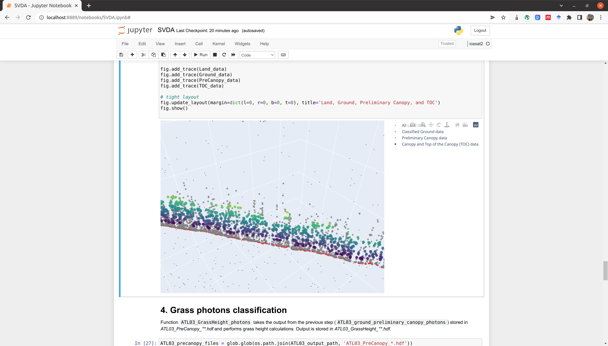

# ICESat-2 SVDA
This repository contains the python codes and Jupyter Notebooks for the "Sparse Vegetation Detection Algorithm" (SVDA) to process ICESat-2 ATL03 data.

When using the codes from this github environment, please cite:
Atmani, F., Bookhagen, B., and Smith, T.: **Measuring vegetation heights and their seasonal changes in the western Namibian savanna using spaceborne lidars**

Detailed concept and theoretical background information are described in the journal article "Measuring vegetation heights and their seasonal changes in the western Namibian savanna using spaceborne lidars"

## Jupyter Notebooks
We provide a set of Jupyter Notebooks that will guide through the processing steps.



### Installation of a dedicated conda environment
In order to run the codes and follow the steps in the Jupyter Notebooks, you will need to have installed several additional packages. This can be done through [miniconda](https://docs.conda.io/en/latest/miniconda.html) or [Anaconda](https://www.anaconda.com/).

Here is a code-snippet to install the required packages into an conda environment called `icesat2`:

```
conda create -y -n icesat2 -c conda-forge ipython numpy python \
  ipython matplotlib h5py pandas scipy pyproj pip fiona shapely \
  jupyter ipywidgets gdal tqdm scikit-learn weightedstats \
  geopandas cartopy plotly
conda activate icesat2
pip install tables laspy requests
```

Some of these modules are not required for running the code (for example, `cartopy` and `plotly`), but they are useful when interactively exploring the data.


You can also add this conda environment to be recognized by Jupyter Notebooks:
```
python -m ipykernel install --user --name=icesat2
```

### Additional packages for ICESat-2
**These are not required to run the SVDA classification code, but are helpful when working with ICESat-2 data.**

In addition, you may want to install the python tools for obtaining and working with elevation data from the NASA ICESat-2 mission from github. This relies on MPI/OPENMPI and you may need to make sure to install the correct version of the compilers within conda. Alternatively, you can install the packages to the system. The following snippet works on an Ubuntu 18.04 and 20.04, but should be easily transferable to other systems.


```
cd ~
conda activate icesat2
pip install pyGEDI
conda install -y mpi4py
conda install -c -y conda-forge openmpi-mpicc
conda install -c -y conda-forge c-compiler compilers cxx-compiler
git clone https://github.com/tsutterley/read-ICESat-2.git
cd read-ICESat-2
export OMPI_MCA_opal_cuda_support=true
python setup.py build
python setup.py install
cd ~
```

### More additional packages
If you plan to use Google Earth Engine, you will need to install their API:
```
conda activate icesat2
conda install -c conda-forge earthengine-api geemap
```

*Note that these are generally very large.*


Now you should be ready to run the various Jupyter Notebooks and steps.
